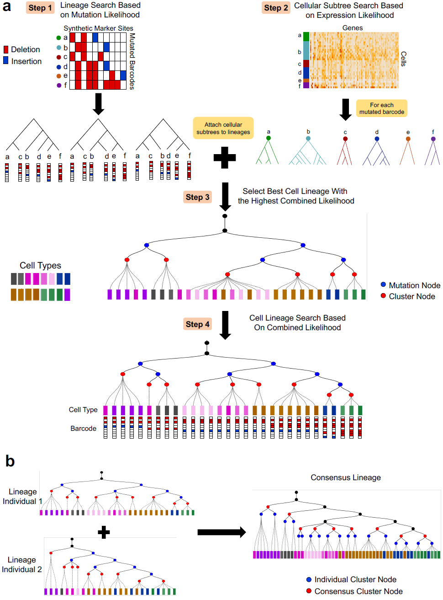

# LinTIMaT
Lineage Tracing by Integrating Mutation and Transcriptomic data

This github repository provides the examples of running LinTIMaT (Lineage Tracing by Integrating Mutation and Transcriptomic data) for the paper "Single-cell Lineage Tracing by Integrating CRISPR-Cas9 Mutations with Transcriptomic Data". See the abstract below:
Recent studies combine two novel technologies, single-cell RNA-sequencing and CRISPR-Cas9 barcode editing for elucidating developmental lineages at the whole organism level. While these studies provided several insights regarding developmental lineages, they face several computational challenges. First, the trees are reconstructed based on noisy and often saturated random mutation data. Additionally, due to the randomness of the mutations, lineages from multiple experiments cannot be combined to reconstruct a consensus lineage. To address these issues, we developed a novel method, LinTIMaT, which reconstructs cell lineages in a maximum-likelihood framework by integrating mutation and expression data. Our analysis shows that expression data helps resolve the ambiguities arising in individual lineages when inferred based on mutations alone, while also enabling the integration of different individual lineages for the reconstruction of a consensus lineage. Lineages reconstructed by LinTIMaT provide better cell type coherence, improve the functional significance of gene sets and can provide new insights on progenitors and differentiation pathways.

In this github repository, we provide the example code to reconstruct similar zebrafish lineage tree listed in the paper. The raw dataset is take from https://www.ncbi.nlm.nih.gov/geo/query/acc.cgi?acc=GSE105010.
The processed input files for ZF1 and ZF3 is https://drive.google.com/file/d/1DI4N7eG7Rn4hopVYGV6iILHilvz8LbQA/view?usp=sharing

## Before you begin
download this repository, and download the the processed input file from https://drive.google.com/file/d/1DI4N7eG7Rn4hopVYGV6iILHilvz8LbQA/view?usp=sharing, unzip the file data.zip and move the file "ZF1_F3_DrImpute.txt" and "ZF3_F6_DrImpute.txt" to the data/ folder of this repository.

## INPUT of LinTIMaT
LinTIMaT runs on data with single cell RNA-Seq data where each cell has mutated barcodes. If the RNA-Seq data is not processed, the instruction about how to calculate expression based on RNA-Seq raw reads can be found in many other studies, e.g (https://www.ncbi.nlm.nih.gov/pmc/articles/PMC4728800/). 

Once we get the RNA-Seq gene expression, the expression data should be transformed to log space for example by log2(x+1) where x could represent the gene expression in terms of RPKM, FPKM or TPM depending. For the mutated barcode, it should be given as a single string with mutation events on different sites separated by "-" character. Mutation events can be NONE when no mutation is observed on this site, or conprise with deletion/insertion length and the position. For example, assumes that there are 4 possible sites for mutation, one possible mutation sring can be NONE-10D+113-NONE-5I+256+ATCGA. This means that for site 1 and site 3, there is no mutation, for site 2, there is a deletion of 10 basepairs happend at position 113, for site 4, there is a insertion of 5 base pairs (ATCGA) at position 256.

The input file has the following formatting requirements:  
* __Header Row__   
	First 3 columns are "Cells","ClusterIdent","HMID" and the remaining columns are gene names.  
* __Data Rows__   
	* __1st column__: Cell ID, String, represents the ID for the cell. (should be unique)  
	* __2nd column__: Cell label, Integer, represents  the label of the cell (e.g cell type if known). In most cases, we don't have any prior knowledge of the cell type. In this case, use 0 instead. Or, you can use any name you want to label each cell. We don't use this information in building the lineage tree and it's only used to mark the cells in visualization.  
	* __3rd column__: Cell mutation barcode, String, mutation events on different sites separated by "-" character.  
	* __4th- columns__: Gene expression values.    
    
    Note that each entry of the data is separated by "\t" character.  
	Example processed input file can be downloaded from here:  
    https://drive.google.com/file/d/1DI4N7eG7Rn4hopVYGV6iILHilvz8LbQA/view?usp=sharing
    
    

